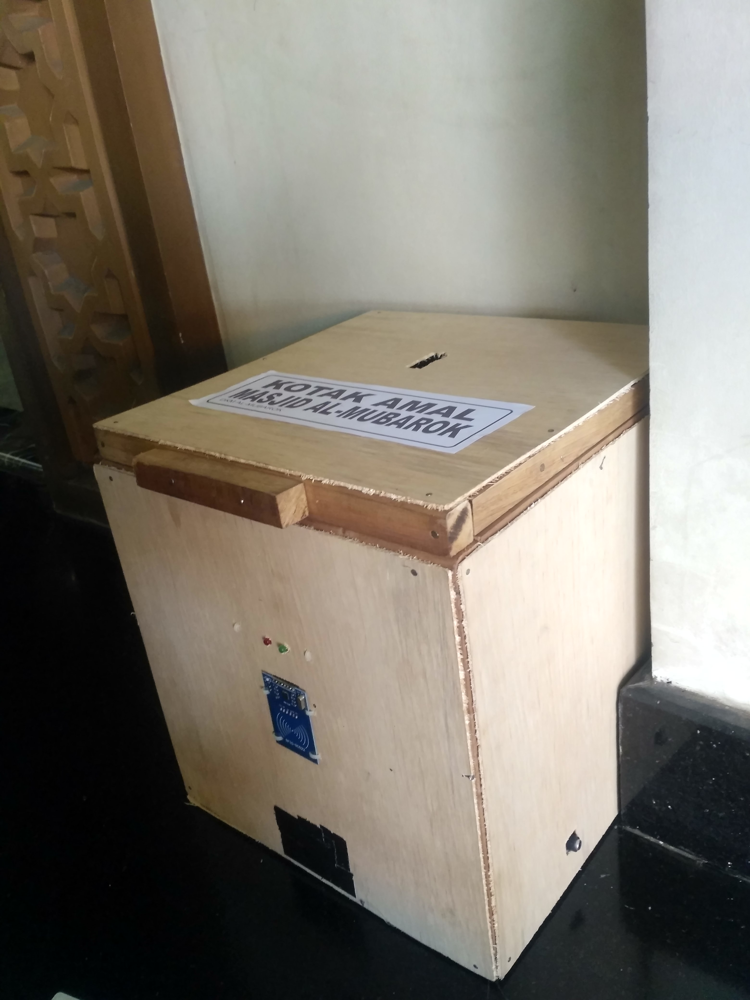
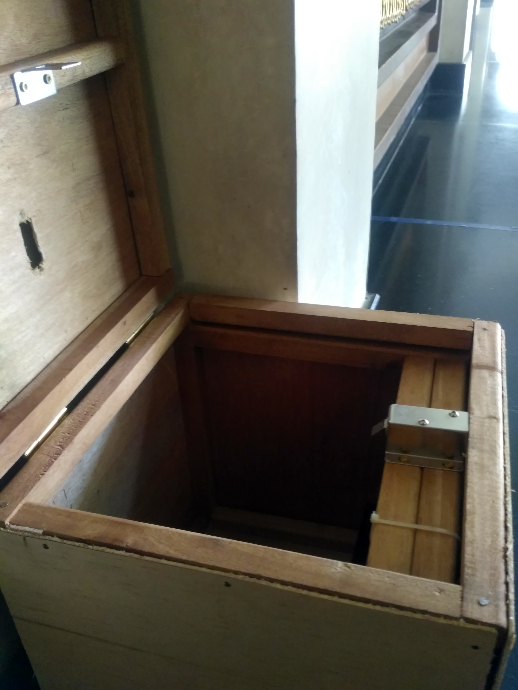
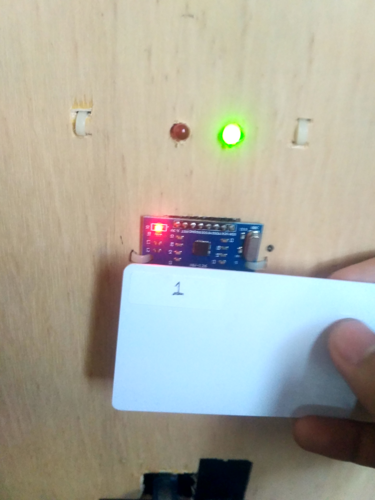
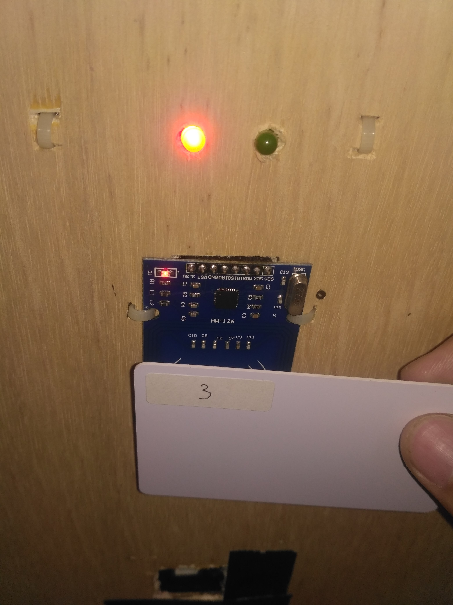
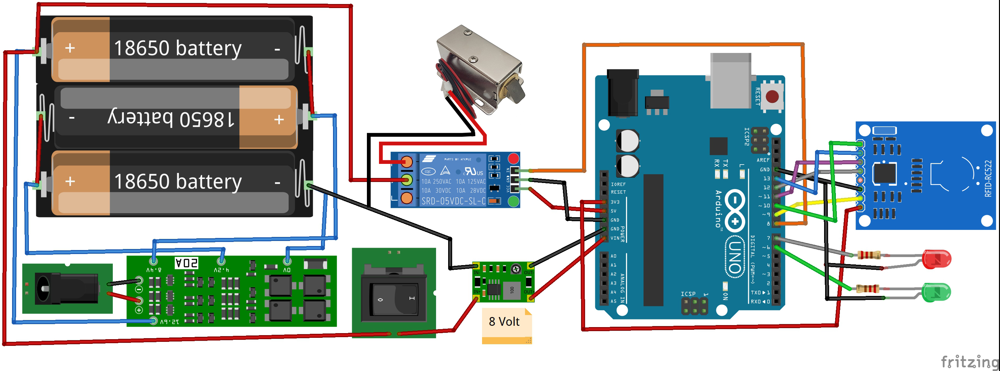

# Kotak Amal Dengan Card Security System

### Ringkasan

Proyek ini bertujuan untuk membuat kotak amal dengan sistem pengaman berupa kartu dengan maksud untuk mengurangi penggunaan gembok. Proyek ini merupakan proyek Praktik Kerja Lapangan (PKL) yang dimaksudkan untuk memenuhi syarat melaksanakan tugas akhir di jurusan Fisika, Fakultas Sains dan Teknologi Universitas Islam Negeri Syarif Hidayatullah Jakarta.

    
    
    
    

### Fitur

1. Kotak amal hanya dapat dibuka menggunakan kartu yang telah didaftarkan
2. Bisa menggunakan lebih dari 1 kartu, selama kartu tersebut telah didaftarkan
3. Indikator lampu hijau menandakan kartu telah terdaftar sedangkan lampu merah menandakan kartu belum terdaftar
4. Kotak amal akan tetap terkunci walaupun dalam kondisi OFF
5. Baterai dapat diisi ulang dengan menggunakan adaptor 12 Volt

### Arduino Library Yang Digunakan

`MFRC522.h` oleh [miguelbalboa](https://github.com/miguelbalboa/rfid)

### Komponen Yang Digunakan

1. Arduino Uno
2. RFID Reader MFRC522
3. RFID Tag
4. Solenoid Lock 12 Volt
5. Relay 5 Volt
6. LED Hijau disertai resistor 220 ohm
7. LED Merah disertai resistor 220 ohm
8. 3 buah Baterai 18650
9. Battery Management System (BMS) 3S 20A
10. Buck Converter MP2307
11. Saklar
12. Jack DC Female

### Wiring Diagram

